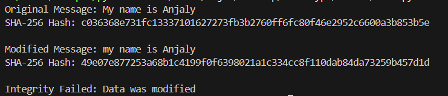

# Hashing Fundamentals: Data Integrity & Security

Hashing is a **one-way mathematical process** that transforms **any-size input data** into a **fixed-length hash digest** (fingerprint). It's essential for verifying **data integrity** and securing sensitive information like passwords.

---

## 1. Hashing Process & Data Integrity Role

### The Process

Input: Any data (file, message, password)

Hash Function: Complex math (compression + mixing)

Output: Fixed-size digest (e.g., SHA-256 = 256 bits / 64 hex chars)

Key Properties:
- ✅ Deterministic: Same input → same hash
- ✅ Fast computation
- ✅ Irreversible (one-way)
- ✅ Avalanche effect: 1-bit change → ~50% hash bits flip

### Data Integrity Verification

Sender: File → Hash → Send (File + Hash)

Receiver: File → Hash → Compare

Match? → ✅ Integrity OK

No Match? → ❌ Tampered/Corrupted


**Real use**: Software downloads provide SHA-256 checksums. You verify your download matches.

---

## 2. Popular Hashing Algorithms

| **Algorithm** | **Digest Size** | **Status** | **Security Level** | **Use Case** |
|---------------|-----------------|------------|--------------------|--------------|
| **MD5** | 128 bits (32 hex) | 🚫 **Broken** | 64-bit collisions | Legacy checksums |
| **SHA-1** | 160 bits (40 hex) | 🚫 **Deprecated** | 80-bit collisions | Old certs/updates |
| **SHA-256** | 256 bits (64 hex) | ✅ **Secure** | 128-bit security | Modern everything |

**Timeline** :
- 1991: MD5 (now broken)
- 1995: SHA-1 (broken 2017)
- 2001: SHA-256 (secure today)


**Recommendation**: SHA-256 or SHA-3 for new projects.

---

## 3. Collision Resistance (Critical Concept)

Collision = Hash(A) = Hash(B) where A ≠ B

Why it matters:
- MaliciousFile + InnocentFile → Same Hash
- System trusts hash → Accepts malware!


### Attack History

- 2004: MD5 collisions demonstrated (Chinese researchers)
- 2012: Practical MD5 collision attack
- 2017: Google + CWI create first SHA-1 collision (SHAtter attack)
- 2020+: SHA-256 remains collision-resistant

### Salt for passwords

hash(password + unique_salt_per_user)
Prevents rainbow tables and identical password attacks

---

## 4. Example

```
import hashlib

# Original message
message = "My name is Anjaly"

# Hash using SHA-256
hash1 = hashlib.sha256(message.encode()).hexdigest()

print("Original Message:", message)
print("SHA-256 Hash:", hash1)

# Modify the message
modified_message = "my name is Anjaly"

# Hash modified message
hash2 = hashlib.sha256(modified_message.encode()).hexdigest()

print("\nModified Message:", modified_message)
print("SHA-256 Hash:", hash2)

# Integrity check
if hash1 == hash2:
    print("\nIntegrity Verified: No change detected")
else:
    print("\nIntegrity Failed: Data was modified")

```
### Output: 



