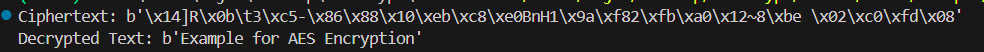

## Overview
This document provides a structured study reference for two foundational symmetric-key encryption algorithms:
AES (Advanced Encryption Standard) and DES (Data Encryption Standard).
It covers their mechanisms, strengths, limitations, and practical differences.
A Python example for AES encryption is also included.

---
# 1. Advanced Encryption Standard (AES)

## 1.1 What is AES?
AES is a symmetric block cipher adopted as a U.S. federal standard in 2001.
It is widely used across modern cryptographic systems due to its strong security, efficiency, and resistance to known attacks.

## 1.2 AES Block Size
- AES uses a fixed block size of 128 bits.

## 1.3 AES Key Lengths
AES supports three key sizes:

| AES Variant | Key Length | Number of Rounds |
|-------------|------------|------------------|
| AES-128     | 128 bits   | 10               |
| AES-192     | 192 bits   | 12               |
| AES-256     | 256 bits   | 14               |

## 1.4 AES Modes of Operation
AES is typically used with a mode of operation to encrypt data larger than one block.

| Mode | Description | Strengths | Weaknesses |
|------|-------------|-----------|------------|
| ECB  | Encrypts each block independently | Simple | Leaks patterns; insecure |
| CBC  | XOR with previous ciphertext block | Hides patterns | Sequential; slower |
| CFB  | Stream-like operation | No padding needed | Slower than CTR |
| OFB  | Generates keystream | Error-resistant | Vulnerable to bit-flipping |
| CTR  | Turns AES into a stream cipher | Fast, parallelizable | Requires unique nonce |
| GCM  | Authenticated encryption | Integrity + confidentiality | Needs careful nonce mgmt |

---
# 2. Data Encryption Standard (DES)

## 2.1 What is DES?
DES is a symmetric block cipher developed in the 1970s.
It was widely used for decades but is now considered cryptographically broken.

## 2.2 DES Mechanism
- Block size: 64 bits
- Key size: 56 bits (64-bit key with 8 parity bits)
- Rounds: 16
- Feistel network structure
- Uses permutations, substitutions (S-boxes), and XOR operations

## 2.3 Security Limitations of DES
DES is no longer secure due to:

###  Small key size (56 bits)
- Vulnerable to brute-force attacks
- Modern hardware can break DES in hours or minutes

###  Outdated design
- S-boxes and structure are not strong enough for modern threat models

###  Replaced by AES
- NIST officially deprecated DES
- Triple DES (3DES) extended its life but is also now deprecated

---
#  3. AES vs DES — Comparison

## 3.1 Speed
| Algorithm | Speed | Notes |
|-----------|--------|-------|
| AES       | Fast   | Hardware acceleration (AES-NI) |
| DES       | Slow   | Outdated design; inefficient on modern CPUs |

## 3.2 Security Strength
| Feature | AES | DES |
|---------|------|------|
| Key Size | 128/192/256 bits | 56 bits |
| Brute Force Resistance | Extremely strong | Broken |
| Modern Attacks | Resistant | Vulnerable |
| Standard Status | Current | Deprecated |

## 3.3 Use Cases
| Algorithm | Typical Use Cases |
|-----------|-------------------|
| AES | VPNs, TLS/SSL, disk encryption, cloud storage, Wi-Fi security (WPA2/WPA3), secure messaging |
| DES | Legacy systems only; not recommended |

---
# 4. Python AES Encryption Example

Below is a simple AES-256 encryption example using the pycryptodome library.

```python
from cryptography.hazmat.primitives.ciphers import Cipher, algorithms, modes
from cryptography.hazmat.backends import default_backend
from cryptography.hazmat.primitives import padding
import os

# Data
plaintext = b"Example for AES Encryption"

# AES-256 Key & IV
key = os.urandom(32)   # 256-bit key
iv = os.urandom(16)    # 128-bit IV


# Padding
padder = padding.PKCS7(128).padder()
padded_data = padder.update(plaintext) + padder.finalize()

# Encrypt
cipher = Cipher(algorithms.AES(key), modes.CBC(iv), backend=default_backend())
encryptor = cipher.encryptor()
ciphertext = encryptor.update(padded_data) + encryptor.finalize()

print("Ciphertext:", ciphertext)

# Decrypt
decryptor = cipher.decryptor()
decrypted_padded = decryptor.update(ciphertext) + decryptor.finalize()

# Remove padding
unpadder = padding.PKCS7(128).unpadder()
decrypted = unpadder.update(decrypted_padded) + unpadder.finalize()

print("Decrypted Text:", decrypted)


```


---
# 5. Summary
AES is the modern, secure, and efficient standard for symmetric encryption. DES, while historically important, is no longer secure and should not be used in new systems.

AES offers:
- Strong security
- Multiple key sizes
- Fast performance
- Wide adoption
